# Beyond Foundry Comprehensive Flow Diagram

This document provides a detailed, high-level flow diagram (in Mermaid format) covering all major Beyond Foundry functionalities, including spell import (full directory and character-limited), character import, item import, monster import, compendium management, error handling, and UI feedback. This is intended as a single reference for the overall Beyond Foundry workflow and architecture.

---

## Mermaid Flowchart: Beyond Foundry Functionalities

```mermaid
flowchart TD
    A[🎯 User Initiates Import] --> B{Select Content Type}
    B -->|Character| C1[🧑‍🎤 Character Import]
    B -->|Spell| C2[✨ Spell Import]
    B -->|Item| C3[🗡️ Item Import]
    B -->|Monster| C4[👹 Monster Import]
    B -->|Other| C5[📚 Other Content Import]

    %% Character Import
    C1 --> D1[🔑 Authenticate DDB/Proxy]
    D1 --> E1[📥 Fetch Character Data]
    E1 --> F1[🔎 Validate & Parse Character]
    F1 --> G1[🔄 Transform to Foundry Actor]
    G1 --> H1[💾 Save to Compendium/World]
    H1 --> I1[✅ UI Feedback & Metrics]

    %% Spell Import (Branch: Full Directory vs Character-Limited)
    C2 --> D2{Import Scope}
    D2 -->|Full Directory| E2[📥 Fetch All Spells]
    D2 -->|Character Spells| F2[📥 Fetch Character Spell List]
    E2 --> G2[🔎 Validate & Parse Spells]
    F2 --> G2
    G2 --> H2[🔄 Transform to Foundry Items]
    H2 --> I2[💾 Save to Compendium/World]
    I2 --> J2[✅ UI Feedback & Metrics]

    %% Item Import
    C3 --> D3[🔑 Authenticate DDB/Proxy]
    D3 --> E3[📥 Fetch Items]
    E3 --> F3[🔎 Validate & Parse Items]
    F3 --> G3[🔄 Transform to Foundry Items]
    G3 --> H3[💾 Save to Compendium/World]
    H3 --> I3[✅ UI Feedback & Metrics]

    %% Monster Import (Planned)
    C4 --> D4[🔑 Authenticate DDB/Proxy]
    D4 --> E4[📥 Fetch Monsters]
    E4 --> F4[🔎 Validate & Parse Monsters]
    F4 --> G4[🔄 Transform to Foundry Actors]
    G4 --> H4[💾 Save to Compendium/World]
    H4 --> I4[✅ UI Feedback & Metrics]

    %% Other Content Import (Feats, Backgrounds, Races, Classes, Rules, Adventures)
    C5 --> D5[🔑 Authenticate DDB/Proxy]
    D5 --> E5[📥 Fetch Content]
    E5 --> F5[🔎 Validate & Parse Content]
    F5 --> G5[🔄 Transform to Foundry Format]
    G5 --> H5[💾 Save to Compendium/World]
    H5 --> I5[✅ UI Feedback & Metrics]

    %% Compendium Management
    subgraph Compendium Management
        J1[📦 Create/Update Compendium]
        J2[🗑️ Remove Duplicates]
        J3[🔄 Sync Content]
        J4[⚠️ Error Handling]
        J5[📊 Track Import Stats]
    end
    H1 --> J1
    I2 --> J1
    H3 --> J1
    H4 --> J1
    H5 --> J1
    J1 --> J2 --> J3 --> J4 --> J5
    J5 --> K[✅ Final UI Feedback]

    %% Error Handling & UI Feedback
    classDef process fill:#f3e5f5,stroke:#4a148c,stroke-width:2px
    classDef decision fill:#fff3e0,stroke:#e65100,stroke-width:2px
    classDef error fill:#ffebee,stroke:#c62828,stroke-width:2px
    classDef success fill:#e8f5e8,stroke:#2e7d32,stroke-width:2px
    classDef startEnd fill:#e1f5fe,stroke:#01579b,stroke-width:2px
    class A,B,C1,C2,C3,C4,C5 startEnd
    class D1,E1,F1,G1,H1,I1,D2,E2,F2,G2,H2,I2,J2,J3,J4,J5,K process
    class D3,E3,F3,G3,H3,I3,D4,E4,F4,G4,H4,I4,D5,E5,F5,G5,H5,I5 process
    class J1 process
    class D2 decision

    %% Error Handling
    J4 --> L[🚨 Log Errors & Provide Recovery]
    L --> K
```

---

## Flow Description

### 1. User Initiates Import
- User selects the type of content to import (character, spell, item, monster, or other)

### 2. Content Import Branches
- **Character Import**: Authenticates, fetches character data, parses and transforms to Foundry actor, saves, and provides UI feedback.
- **Spell Import**: User chooses between full spell directory or character-limited import. Fetches appropriate spell data, parses, transforms, saves, and provides UI feedback.
- **Item Import**: Authenticates, fetches items, parses, transforms, saves, and provides UI feedback.
- **Monster Import**: (Planned) Authenticates, fetches monsters, parses, transforms, saves, and provides UI feedback.
- **Other Content**: (Feats, backgrounds, races, classes, rules, adventures) Authenticates, fetches, parses, transforms, saves, and provides UI feedback.

### 3. Compendium Management
- After import, content is managed in compendiums: creation/updating, duplicate removal, syncing, error handling, and statistics tracking.

### 4. Error Handling & UI Feedback
- All branches include robust error handling and user feedback at each stage, with logging and recovery mechanisms.

---

## Notes
- This diagram covers both implemented and planned features (e.g., monster and adventure import).
- The spell import branch explicitly distinguishes between full-directory and character-limited imports.
- Compendium management and error handling are centralized for all import types.
- For detailed spell import logic, see `docs/spell-import-flow-diagram.md`.

---

## See Also
- [Spell Import Flow Diagram](./spell-import-flow-diagram.md)
- [FOUNDRY_INTEGRATION_GUIDE.md](./FOUNDRY_INTEGRATION_GUIDE.md)
- [SPELL_ENHANCEMENT_COMPLETE.md](./SPELL_ENHANCEMENT_COMPLETE.md)
- [README.md](../README.md)
