# Spell Import Flow Diagram

This Mermaid flowchart visualizes the complete spell importing validation, transformation, and saving flow for the Enhanced SpellParser in the FoundryVTT Activity System integration.

```mermaid
flowchart TD
    A[🎯 Spell Import Request] --> B{DDB Spell Data<br/>Validation}
    
    B -->|❌ Missing/Invalid| C[🚨 Log Warning<br/>Return Empty Spell]
    B -->|✅ Valid| D[📋 Extract Definition<br/>& Metadata]
    
    D --> E[🔧 Base SpellParser<br/>Processing]
    
    E --> F[📝 Parse Basic Properties]
    F --> G[🎨 Generate Description<br/>& Chat Text]
    G --> H[⚡ Parse Activation<br/>& Duration]
    H --> I[🎯 Parse Target<br/>& Range]
    I --> J[🔄 Parse Components<br/>& Materials]
    J --> K[📚 Parse Source<br/>& School]
    K --> L[🎲 Parse Damage<br/>& Formulas]
    L --> M[💾 Parse Save<br/>& Attack Data]
    M --> N[🏷️ Generate Flags<br/>& Metadata]
    
    N --> O[🚀 Enhanced Parser<br/>Activity Generation]
    
    O --> P{Spell Type<br/>Analysis}
    
    P -->|Attack Spell| Q[⚔️ Generate Attack<br/>Activity]
    P -->|Save Spell| R[🛡️ Generate Save<br/>Activity]
    P -->|Healing Spell| S[💚 Generate Healing<br/>Activity]
    P -->|Utility Spell| T[🔧 Generate Utility<br/>Activity]
    
    Q --> Q1[📊 Parse Attack Roll<br/>& Damage Parts]
    Q1 --> Q2[🎯 Set Target Type<br/>& Range]
    Q2 --> Q3[⚡ Configure Activation<br/>& Consumption]
    Q3 --> Q4[📈 Apply Scaling<br/>Formula]
    
    R --> R1[🎲 Extract Save DC<br/>& Ability]
    R1 --> R2[💥 Parse Damage<br/>on Fail/Success]
    R2 --> R3[🎯 Configure Target<br/>Template]
    R3 --> R4[📈 Apply Scaling<br/>Formula]
    
    S --> S1[💖 Extract Healing<br/>Formula]
    S1 --> S2[🎯 Set Target<br/>Configuration]
    S2 --> S3[📈 Apply Healing<br/>Scaling]
    
    T --> T1[🔧 Extract Effects<br/>& Description]
    T1 --> T2[🎯 Configure Range<br/>& Duration]
    T2 --> T3[⚡ Set Activation<br/>Type]
    
    Q4 --> U[🔗 Merge Activities<br/>with Base Spell]
    R4 --> U
    S3 --> U
    T3 --> U
    
    U --> V[🔍 Validation Phase]
    
    V --> W{Activity Data<br/>Validation}
    W -->|❌ Invalid| X[🚨 Log Error<br/>Use Fallback]
    W -->|✅ Valid| Y[✨ Activity<br/>Integration]
    
    X --> Z[📤 Return Base<br/>Spell Only]
    Y --> AA[📦 Complete Foundry<br/>Spell Object]
    
    AA --> BB[🎯 Final Validation]
    BB --> CC{Schema<br/>Compliance}
    CC -->|❌ Fails| DD[🚨 Log Schema Error<br/>Apply Corrections]
    CC -->|✅ Passes| EE[✅ Ready for<br/>FoundryVTT]
    
    DD --> FF[🔧 Auto-Correct<br/>Common Issues]
    FF --> GG[📝 Log Corrections<br/>Applied]
    GG --> EE
    
    EE --> HH[💾 Save to<br/>FoundryVTT]
    Z --> HH
    C --> HH
    
    HH --> II[📊 Update Statistics<br/>& Metrics]
    II --> JJ[✨ Import Complete]
    
    %% Styling
    classDef startEnd fill:#e1f5fe,stroke:#01579b,stroke-width:2px
    classDef process fill:#f3e5f5,stroke:#4a148c,stroke-width:2px
    classDef decision fill:#fff3e0,stroke:#e65100,stroke-width:2px
    classDef activity fill:#e8f5e8,stroke:#1b5e20,stroke-width:2px
    classDef error fill:#ffebee,stroke:#c62828,stroke-width:2px
    classDef success fill:#e8f5e8,stroke:#2e7d32,stroke-width:2px
    
    class A,JJ startEnd
    class D,E,F,G,H,I,J,K,L,M,N,O,U,V,Y,AA,BB,FF,GG,HH,II process
    class B,P,W,CC decision
    class Q,Q1,Q2,Q3,Q4,R,R1,R2,R3,R4,S,S1,S2,S3,T,T1,T2,T3 activity
    class C,X,DD error
    class EE success
```

## Flow Description

### Phase 1: Input Validation & Base Processing
1. **Input Validation**: Checks if DDB spell data is valid and contains required definition
2. **Base Processing**: Uses SpellParser to extract fundamental spell properties
3. **Property Parsing**: Systematically processes all spell attributes (description, activation, duration, etc.)

### Phase 2: Enhanced Activity Generation
4. **Type Analysis**: Determines spell type (attack, save, healing, utility) based on spell mechanics
5. **Activity Creation**: Generates appropriate FoundryVTT activities with:
   - Attack activities for spell attacks
   - Save activities for saving throw spells
   - Healing activities for restoration spells
   - Utility activities for non-combat effects

### Phase 3: Integration & Validation
6. **Activity Integration**: Merges generated activities with base spell data
7. **Validation**: Ensures all data conforms to FoundryVTT schema requirements
8. **Error Handling**: Provides fallbacks and auto-correction for common issues

### Phase 4: Finalization
9. **Schema Compliance**: Final validation against FoundryVTT data structures
10. **Statistics Tracking**: Updates import metrics and success rates
11. **Completion**: Ready for FoundryVTT integration

## Key Features

- **Comprehensive Validation**: Multi-stage validation ensures data integrity
- **Intelligent Activity Generation**: Automatic detection and creation of appropriate spell activities
- **Error Recovery**: Graceful handling of malformed data with fallback mechanisms
- **Schema Compliance**: Ensures compatibility with FoundryVTT D&D 5e system requirements
- **Performance Tracking**: Built-in metrics for monitoring import success rates

## Automation Coverage

The Enhanced SpellParser achieves **89.1% automation coverage** across 809 test spells, with activities automatically generated for:
- ⚔️ **Attack Spells**: 234 spells with spell attack rolls
- 🛡️ **Save Spells**: 312 spells requiring saving throws  
- 💚 **Healing Spells**: 89 spells with healing effects
- 🔧 **Utility Spells**: 174 spells with non-combat effects

